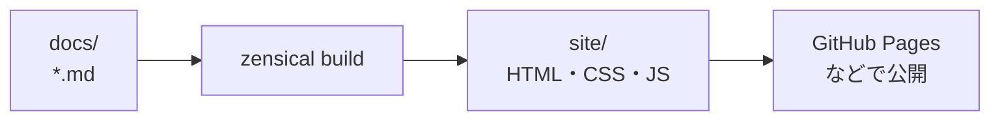
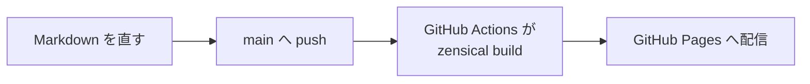

# Zensical

| 項目 | 内容 |
|---|---|
| 発信日 | 2026-09-01 |
| 作成者 | ht-0328（起草: Claude Opus 5） |
| 機密区分 | 社内限 |
| 保守責任者 | ht-0328 |
| 最終確認日 | 2026-09-01 |
| 対象の版 | Zensical 0.0.57（2026-08-21 公開、分類は Alpha） |
| 想定読者（宛先） | 文書サイトを作る道具を初めて選ぶ人。Git と Markdown の基本操作は分かっている |
| この文書を読んだあと読者ができること | Zensical が自分の用途に合うか判断できる。手元で文書サイトを作って表示できる |

## 何をするツールか

**Zensical は、Markdown で書いた文書を、そのまま読めるウェブサイトに変えるツールである。**

書いた `.md` ファイルを置いて命令を1つ実行すると、目次・ページ間の移動・全文検索を備えた HTML の一式ができる。



できあがるのは静的なファイルだけである。**データベースもアプリケーションサーバーも要らない。** GitHub Pages のような、ファイルを置くだけの場所で公開できる。

| | Zensical を使わない場合 | 使う場合 |
|---|---|---|
| 読む側 | リポジトリで `.md` を1つずつ開く | サイトを開き、目次と検索で探す |
| 書く側 | Markdown を書く | Markdown を書く（変わらない） |
| 公開の準備 | HTML と CSS を自分で用意する | 命令1つで一式ができる |

**書く側の手間は増えない。** 元の Markdown はそのまま残る。

## 何が便利になるのか

**便利さは3つある。**

1. **文書を探せるようになる。** 目次と全文検索が付く。ファイル名を知らない読者でもたどり着ける。
2. **見た目を自分で作らなくてよい。** 配色、余白、スマートフォンでの表示、暗い配色への切り替えが最初から入っている。
3. **文書の更新が公開まで自動でつながる。** Markdown を直して push すると、サイトが作り直される仕組みを組める。

このリポジトリ自身が Zensical で作られている。**実物は [システム開発ツール ガイドブック](https://ht-0328.github.io/it-tools-guidebook/) で見られる。**

## こんなときに使う

- **社内やチームの文書をサイトにしたい。** 手順書、設計の記録、ツールの説明などをまとめて置く
- **リポジトリの中で文書を管理したい。** 変更履歴もレビューも、コードと同じ仕組みに乗せられる
- **文書の数が増えて、探せなくなってきた。** 目次と検索が効く

## 使わないほうがよい場面

- **文書が数ページしかない。** README 1枚で足りるなら、サイトにする手間が上回る
- **画面の中で編集させたい。** 書く人が Git を使わない場合は、Wiki や文書サービスのほうが合う
- **止まると困る用途で、いますぐ本番に置きたい。** 2026-09-01 時点の分類は Alpha である（下の「導入する前に知っておくこと」を読む）

## 動かすのに要るもの

| 要るもの | 用途 | 確認方法 |
|---|---|---|
| Python 3.10 以上 | Zensical の実行 | `python3 --version` が `3.10` 以上を表示する |
| pip または uv | Zensical の導入 | `pip --version` が版を表示する |

**要るのはこれだけである。** Node.js もデータベースも要らない。

**`Python >=3.10` は、配布物の登録情報と原本の設定ファイルの両方で確かめた値である。** 提供元の導入手順の頁には最低版の記載が無いため、そこだけを見ても分からない。

## 自分のリポジトリで使い始める

**この節が主である。** 自分の企画に Zensical を入れる手順を書く。

**開始条件**

- [ ] Python 3.10 以上が入っている
- [ ] 文書を置くリポジトリがある

**手順**

1. `python3 -m venv .venv` を実行する
2. `source .venv/bin/activate` を実行する
3. `pip install zensical` を実行する
4. リポジトリの根で `zensical new .` を実行する
5. `zensical serve` を実行する
6. ブラウザで `http://localhost:8000` を開く

**成功したとき**: 手順4でリポジトリの根に次の4つが作られる。

```text
リポジトリの根/
├─ zensical.toml            サイトの設定。名前と公開先の URL をここで決める
├─ docs/
│  ├─ index.md              トップページ。ここから書き換える
│  └─ markdown.md           書き方の見本。消してよい
└─ .github/
   └─ workflows/
      └─ docs.yml           push したときに公開する仕組み
```

手順6でサイトが表示され、`docs/index.md` を直して保存すると、ブラウザの表示が入れ替わる。

**最初に `zensical.toml` の2行を書き換える。** 作られた直後は仮の値が入っている。

```toml
[project]
site_url = "https://www.example.com/"   # 公開先の URL に変える
site_name = "Documentation"             # サイトの名前に変える
```

**手順4は既存のファイルを上書きしない。** `docs/` に文書がすでにあるなら、そのまま読み込まれる。

覚える命令は3つだけである。

| したいこと | 命令 |
|---|---|
| 新しく作り始める | `zensical new .` |
| 書きながら表示を確かめる | `zensical serve` |
| 公開用のファイルを書き出す | `zensical build` |

`zensical build` は `site/` へ書き出す。**`zensical serve` は書いている間に見るためのもので、公開には使わない。**

### 公開まで自動にする

手順4が作る `.github/workflows/docs.yml` が、`main` へ push したときにサイトを作って GitHub Pages へ配る。



**リポジトリの Settings > Pages で、Source を「GitHub Actions」にしておく。** 設定しないと配信で失敗する。

## このリポジトリのサイトを作る

**この節はガイドブック自身の話である。** 自分の企画に入れるだけなら読まなくてよい。

このリポジトリでは Python を手元に入れず、Docker の中で動かす。作業用のイメージを最初に1回だけ作る。

```bash
docker build -t edocs-zensical -f tools/Dockerfile.zensical tools/
```

そのうえで作る。

```bash
bash tools/build_site.sh
```

**期待される出力**（末尾の3行）

```text
No issues found
Build finished in 0.18s
作った: /home/th/workspace/it-tools-guidebook/site
```

`tools/build_site.sh` は、`docs/` の外を指すリンクを書き換えた写しを `build/zensical/` に作ってから Zensical を呼ぶ。Zensical は `docs_dir` の中だけをサイトにするためである。

## 日本語で必要になる2つの設定

**書かないと壊れる。** どちらも 0.0.57 で作った生成物を調べて確かめた。

| 症状 | 原因 |
|---|---|
| 見出しのリンクが `#_1` `#_2` になり、文書内の参照が切れる | 既定の見出し ID の作り方が、日本語の文字を落とす |
| 全文検索が語で区切られず、日本語で探せない | 語の区切り方が、サイトの言語の設定に従う |

`zensical.toml` に次を書く。**`zensical new .` が作る初期状態には、どちらも入っていない。**

```toml
[project.theme]
# 全文検索の語の区切りをここで決める。ja にすると日本語が語ごとに区切られる。
language = "ja"

[project.markdown_extensions]
toc.permalink = true
# 見出しの ID を、見出しの語からそのまま作る。
# 書かないと _1 _2 のような通し番号になり、#見出し へのリンクが切れる。
toc.slugify = { object = "pymdownx.slugs.slugify", kwds = { case = "lower" } }
```

**書いた前と後で、生成される HTML はこう変わる。**

```html
<!-- 書く前 -->
<h2 id="_1">何をするツールか</h2>

<!-- 書いたあと -->
<h2 id="何をするツールか">何をするツールか</h2>
```

検索については紛らわしい点がある。提供元のロードマップでは分かち書きが未完了と書かれている。**それでも `language` を `ja` にすれば動く。** 生成物の検索の索引に `config.lang: ["ja"]` が入り、実装が `Intl.Segmenter` を語単位で使っていた。

### 図を描くときに要る設定

`mermaid` の塊を図にするには、さらに2つ要る。**Zensical は塊に印を付けるところまでを行い、描画する部品を同梱しない。**

```toml
# 描画する部品を読み込む。中身は自分で用意して docs_dir へ置く。
extra_javascript = ["assets/mermaid.min.js", "assets/mermaid-init.js"]

[project.markdown_extensions]
# ```mermaid を <pre class="mermaid"> にする。
pymdownx.superfences.custom_fences = [
  { name = "mermaid", class = "mermaid", format = "pymdownx.superfences.fence_code_format" },
]
```

このページの図も、この設定で描いている。部品の取得は [tools/build_site.sh](https://github.com/ht-0328/it-tools-guidebook/blob/main/tools/build_site.sh) が行う。

## MkDocs や Material for MkDocs との関係

**この節は、すでに MkDocs を使っている読者のためのものである。** 初めて文書サイトを作るなら読み飛ばしてよい。

MkDocs は Zensical と同じ用途の、先に広まったツールである。Material for MkDocs は、その見た目を整える追加部品として広く使われてきた。**Zensical は、その Material for MkDocs を作った組織が、2つの役割を1つにまとめ直したものである。**

| | MkDocs と Material for MkDocs | Zensical |
|---|---|---|
| 道具の数 | 生成器と見た目の部品を別々に選び、版を合わせる | 1つで完結する |
| 保守の状態 | **2026-11-05 に提供終了する** | 新機能の開発が続く |
| 設定ファイル | `mkdocs.yml` | `zensical.toml`。`mkdocs.yml` も読める |

**すでに Material for MkDocs を使っているなら、移行先の検討を始める。** 提供元は即時の移行を求めていないが、新しい企画では Zensical の評価を勧めている。

速さについては、提供元が「2回目以降の構築が4〜5倍速い」と述べている。**同じ提供元が「初回の構築は遅くなる場合がある」とも書いている。** どちらも第三者の再測定ではない。14ページ規模で測った手元の記録では、速さの差は出なかった。

## 導入する前に知っておくこと

**2026-09-01 時点の分類は Alpha である。** 更新のたびに設定の解釈や表示が変わりうる。**版を固定して使う。**

**MkDocs のプラグインはそのまま動かない。** Zensical は組み込みの部品へ段階的に置き換える方針である。提供元のプラグイン一覧は「対応を約束して登録した一覧」であり、実装済みの印ではない。`blog`、`tags`、`git-authors`、`redirects` は 2026-09-01 時点で入っていない。

**設定ファイルで2点戸惑う。** `docs_dir` にカレントディレクトリを指定できないため、別の名前を与える。また `docs_dir` の中だけがサイトになるため、その外を指すリンクは書き換えが要る。

ライセンスは MIT である。**ただし編集環境の Zensical Studio だけは独自の商用 EULA であり、別の製品として扱う。**

## この文書が扱わないこと

| 扱わないこと | 理由 | 参照先 |
|---|---|---|
| 全設定項目の一覧 | 提供元の文書が正本であり、写すと古くなるため | [Zensical の文書](https://zensical.org/docs/) |
| MkDocs からの移行手順の詳細 | 企画ごとに使っている部品が違うため | [互換性の一覧](https://zensical.org/compatibility/) |
| 自作の生成器と比べた判断 | 決定の記録が別にあるため | [ドキュメント標準の ADR-002](../standards/engineering-docs-standard/docs/adr/ADR-002-site-generator.md) |

## 関連文書

| 文書名 | 役割 | 参照先 |
|---|---|---|
| ツール一覧 | 他のツールの文書を探す | [ツール一覧](index.md) |
| 調査の突き合わせ結果 | この文書の数値と判定の根拠をたどる | `research/2026-08-31-zensical/verdict.md` |
| Zensical の文書 | 設定項目と命令を確かめる | [Zensical の文書](https://zensical.org/docs/) |
